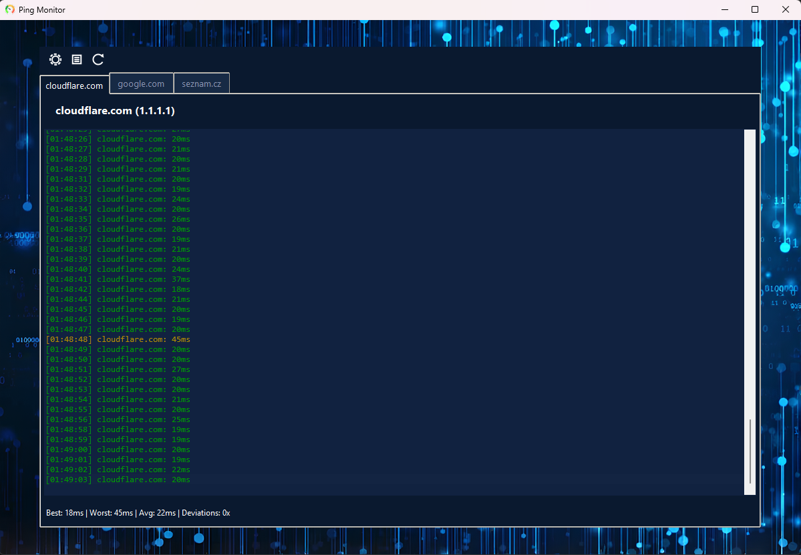

# 📊 Ping Monitor


A simple ping monitoring tool that sits in your system tray and keeps an eye on your network connections. Pings several servers at once for precision and is highly configurable. Perfect for gamers and anyone who wants to know when their internet is acting up.



## ✨ Features

- 🔔 **System Tray Icon**
  - Changes color based on the pings to the **first** server, so you can see approximate network status
    - 🟢 Network is stable (consistent <60ms)
    - 🔴 Network is unstable (often >60ms)
- 🖥️ **Simple & Clean UI**
  - Each pinged server has its own tab
  - Colored results (green < 40ms, yellow 40-60ms, red > 60ms)
    - Yellow is still considered a relatively good ping
  - Bottom bar shows some additional info (e.g., average ms)
- 📝 **Deviation Logging**
  - Records high ping events (>60ms) to `deviations.txt`
  - Default option is to keep track of deviations from past 24 hours
- ⚙️ **Highly Configurable**
  - Customize servers, ping intervals, thresholds, UI theme colors, animation settings and more
  - Full configuration through simple `config.py` with constants
  - See [⚙️ Configuration](#⚙️-configuration) section for more details

## 🛠️ Installation

1. Make sure you have Python 3.14.2 or higher installed
2. Clone or download this repository
3. Setup the app using `setup.bat`:

   ```bash
   setup.bat
   ```

   This will automatically download all required packages and offers you to run the app.

4. If you didn't in previous step, run the app using `run.vbs`:

   ```bash
   run.vbs
   ```

   This is the primary run file, so if you plan to use the app often, creating a desktop shortcut or pinning to hotbar is recommended.

## 📖 Usage

- The application starts minimized to the system tray and immediately starts pinging all the servers in the set interval.
- Right-click the tray icon for options:
  - **Show**: Open the main window
  - **Hide**: Minimize to tray
  - **Exit**: Close the application
- When you open the main window, you'll see your configured servers with real-time ping results displayed in their respective tabs, colored for easy status identification.

## ⚙️ Configuration

#### All configuration is done in `src/core/config.py`.

- **Change what servers you would like to ping**
  ```python
  # Server name (key) can be any string, IP (value) must be real public IP
  SERVERS = {
      "cloudflare.com": "1.1.1.1",
      "google.com": "8.8.8.8",
      "seznam.cz": "77.75.77.222",
      "matejkadlec.cz": "37.9.175.163",
  }
  ```
  There must be at least one server to ping. You can add as many servers as you want; it has very minor impact on the network itself.
- **Change the ping threshold or interval**

  ```python
  PING_THRESHOLD = 60  # ms (for deviation logging)
  PING_INTERVAL = 1    # seconds between pings
  ```

- **Change the preserved time period**

  ```python
  PRESERVED_MINUTES = 10  # minutes to preserve and display per tab
  ```

  Maximum amount of lines per tab is calculated from ping interval and preserved minutes (default is 600 → 10 minutes, 1 ping each second).

- **Customize the UI theme**

  ```python
  THEME = {
      "bg_color": "#111111",           # Background color
      "accent_color": "#ffb400",       # Gold accent color
      "text_color": "#ffffff",         # Text color
      "log_bg_color": "#1e1e1e",       # Log area background
      "bg_highlight_color": "#3a3a3a", # New entry highlight background
  }
  ```

- **Configure deviation logging**

  ```python
  DEVIATIONS_FILE = "deviations.txt"  # File to log high pings
  ```

## 🐞 Troubleshooting

- **App won't start**: Ensure all packages are installed and the virtual environment is activated.
- **Tray icon missing**: Check Windows notification area settings.
- **Ping timeouts**: Verify your internet connection and firewall settings.
- **Auto-start not working**: Re-run the setup tool to configure startup options.
